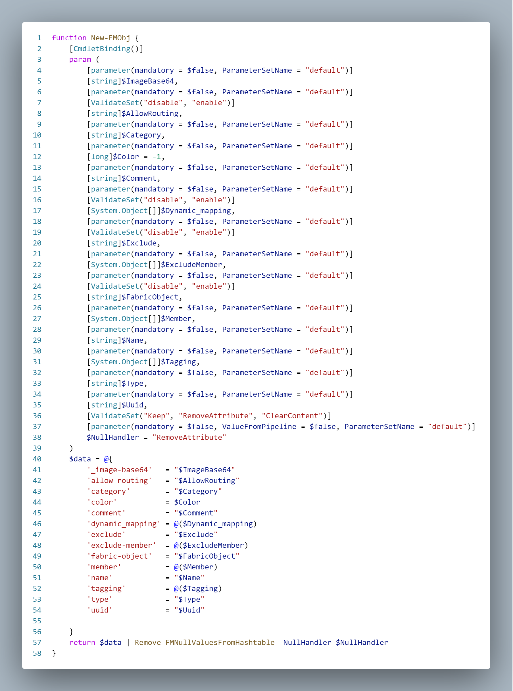

# Contributing to this repository

No need for duplicating basic KnowHow about contributing, I think that everything is [well documented by github ;-)](https://github.com/github/docs/blob/main/CONTRIBUTING.md).

A big welcome and thank you for considering contributing to this repository! Besides the named basics getting an overview of the internal logic is quite helpful if you want to contribute. Let's get started..

## Missing a functionality?

If you are missing a function in this module:
* Identify the corresponding API from the [Fortinet Developer Network](https://fndn.fortinet.net/index.php?/fortiapi/5-fortimanager/)
* Take a look at [Working with the layout](#working-with-the-layout)
* Add a new public function under `\FortiManager\functions`
  * One function per file
  * Filename relates to the function name
  * Add the function to `\FortiManager\FortiManager.psd1` under `FunctionsToExport`
* Make use of [API Proxy Invoke-FMAPI](#api-proxy-Invoke-FMAPI) to access the API - it takes the stress out of coping with default problem
  * With a little bit of trickery you can create time consuming functions/parts by script, see [Easy code creation](#easy-code-creation)
* Add new [Pester tests](#pester-tests) for the new function (completely missing at the moment)
* The module has currently some [limitations](#limitations) - either live with them or fix them by contributing.


### Working with the layout
This module was created with the help of [PSModuleDevelopment](https://github.com/PowershellFrameworkCollective/PSModuleDevelopment) and follows the default folder layout. Therefor the default rules apply:
- Don't touch the psm1 file
- Place functions you export in `functions/` (can have subfolders)
- Place private/internal functions invisible to the user in `internal/functions` (can have subfolders)
- Don't add code directly to the `postimport.ps1` or `preimport.ps1`.
  Those files are designed to import other files only.
- When adding files & folders, make sure they are covered by either `postimport.ps1` or `preimport.ps1`.
  This adds them to both the import and the build sequence.

## API Proxy Invoke-FMAPI

If you take a look at (most) public functions you will recognize the use of `Invoke-FMAPI`. This is a generic access function for any FortiManager API.

### Why not use Invoke-RestMethod/Invoke-WebRequest?

Of course it would be possible to use the native Invoke-RestMethod or Invoke-WebRequest, and this is done. But only within `Invoke-FMAPI` (as it is a wrapper for `Invoke-RestMethod`) and within `Request-FortiManagerOAuthToken` (as this is needed for authentication which is a prerequisite for using `Invoke-FMAPI`).

Every API call basically performs at least the following steps:
* Build the URI to access, including necessary URI parameters
* Build the headers (e.g. for authentication)
* Build the JSON body
* `Invoke-RestMethod`
* Return the response

That's the quick and easy way for getting started. But for robust code there is more:
* Filter `$null` values from the parameters as for example
  * while creating a new folder you can add a note, but you don't have to
  * if you don't need an expiration date you still have to provide one
* Exception handling
  * Does the API throw an exception? Get the details to the logging and rethrow it or not
* Paging
  * Many APIs work with `limit` and `offset` parameters to request only partial information.
  * This is good for performance in user driven apps like the webUI
  * In scripts you perform mass operations in most cases
  * `Invoke-RestMethod` can get all data pages and return all of the data

Just take a look at existing functions, it's hopefully self explaining. Otherwise raise an issue for asking about details.

## Easy code creation
After you've got access to the [API from Fortinet](https://fndn.fortinet.net/index.php?/fortiapi/5-fortimanager/) you can find (roughly guessed) 98% of the available functionality from it. For the remaining 2% you would need to use your browsers developer tools and inspect the network traffic...

Where can the needed information be found and how can it be used for easy code creation?

Let's take the firewall address table as an example. You can find the corresponding API documentation under the mentioned link, following the left menu ["FortiManager 7.2.0 > Configuration Database v7.2 > ADOM Level Objects > pm/config/firewall"](https://fndn.fortinet.net/index.php?/fortiapi/5-fortimanager/1637/5/pm/config/firewall/). From there unfold the swagger documentation for "/pm/config/firewall/address". For creating a new address we are looking for "/pm/config/adom/{adom}/obj/firewall/address (**add**)". 

#### Special note!
You need the module `PSUtil` for the following helper functions.
### Creating the function Add-FMAddress
Take a look at the existing function:


And now the deep look at the parts to be exchanged/modified if using it as an template:
* Main parameter is an array of addresses which should be added (line 7)
* Those input objects get sanitized to only include valid attributes (line 15, 18)
  * If you query an existing address not every returned attribute can be set for new objects!
  * Attributes can be configured, see `FortigateManager\internal\configurations\configuration.ps1`
* For default logging add the corresponding Key from `FortigateManager\en-us\strings.psd1` as LoggingAction (line 24)
* Method (line 26) and Path (line 27) can be obtained from the swagger API.
* The API tells you to add the new address array to the Parameter "data" (Line 28/29)

For this to work we need to construct a valid address object. As an address object consists of 41 top level attributes (which might themselves consist of complex types) creating one in the correct format is quite time consuming. Or it would be if I didn't include some helper functions.

### Create a new object
Back in the API click on example data and you will get the JSON request for creating a new address:
```json Hubba
{
  "method": "add",
  "params": [
    {
      "data": [
        {
          "_image-base64": "string",
          "allow-routing": "disable",
          "associated-interface": "string",
          "cache-ttl": 0,
          "clearpass-spt": "unknown",
          "color": 0,
          "comment": "string",
........
           "type": "ipmask",
          "uuid": "3fa85f64-5717-4562-b3fc-2c963f66afa6",
          "wildcard": "string",
          "wildcard-fqdn": "string"
        }
      ],
      "url": "/pm/config/adom/{adom}/obj/firewall/address"
    }
  ],
  "session": "string",
  "id": 1
}
```
The "data" key contains the attribute structure needed for the address. Copy the content from "data" starting with
```json Hubba
{
  "_image-base64": "string",
  "allow-routing": "disable",
```
and ending with
```json
  "wildcard": "string",
  "wildcard-fqdn": "string"
}
```
to the clipboard. Now execute the following command:
```Powershell
InModuleScope fortigatemanager {Convert-FMApi2HashTable}
```

and past the new clipboard content into an empty powershell file. After formatting it (I like VSCode) it should look like this:


Now all you have to do is
* Name the new function correctly (*New-FMObjAddress* for example, line 1)
* Add some inline help (add ## as a newline before line 2 in VSCode)
* mark the mandatory attributes
* fine tune the detected parameter types

As a result you can create new objects by invoking a regular powershell function with nice CamelCase parameter names.

### Further use of `Convert-FMApi2HashTable`
You can although use the helper function for creating parameters of `Get-/Add-/...` functions. Take the `/pm/config/adom/{adom}/obj/firewall/address (get)` as an example, especially the params-block from the example value:


Copy it to the clipboard and run again
```Powershell
InModuleScope fortigatemanager {Convert-FMApi2HashTable}
```
The resulting dummy code

contains main parts for the real getter function:


Dummy-Lines -> Real-Function-Lines
* 4-19 -> 9-26 (function parameters)
* 26-37 -> 32-41 (parameter mapping to API parameter hashmap)

The `ValidateSet` for the `Fields` paramter was created by copying the enum ("Model" View, not "Example Value" in the API)

``
_image-base64, allow-routing, associated-interface, cache-ttl, clearpass-spt, color, comment, country, dirty, end-ip, epg-name, fabric-object, filter, fqdn, fsso-group, interface, macaddr, name, node-ip-only, obj-id, obj-tag, obj-type, organization, policy-group, sdn, sdn-addr-type, sdn-tag, start-ip, sub-type, subnet, subnet-name, tag-detection-level, tag-type, tenant, type, uuid, wildcard, wildcard-fqdn
``

to the clipboard and then use the Powershell command
```Powershell
Get-Clipboard|split ', '|wrap '"' '"' |join ', '|wrap '[ValidateSet(' ')]'|Set-Clipboard -PassThru
```
to get
```Powershell
[ValidateSet("_image-base64", "allow-routing", "associated-interface", "cache-ttl", "clearpass-spt", "color", "comment", "country", "dirty", "end-ip", "epg-name", "fabric-object", "filter", "fqdn", "fsso-group", "interface", "macaddr", "name", "node-ip-only", "obj-id", "obj-tag", "obj-type", "organization", "policy-group", "sdn", "sdn-addr-type", "sdn-tag", "start-ip", "sub-type", "subnet", "subnet-name", "tag-detection-level", "tag-type", "tenant", "type", "uuid", "wildcard", "wildcard-fqdn")]
```
as new Clipboard Content.

## Pester tests
The module does use pester for general and functional tests. The general tests are provided by [PSModuleDevelopment](https://github.com/PowershellFrameworkCollective/PSModuleDevelopment) and perform checks like *"is the help well written and complete"*. This results in more than 6300 automatic tests over all.

If you create a new function please provide a corresponding pester test within the `\FortiManager\tests\functions` directory. A pester tests should
* Setup the test environment in a clean state
* Teardown/remove the test environment as a last step

If you have only created a Getter function without the corresponding Create/Remove counterparts you will not be able to perform this clean testing. If this happens please either provide the additional functions or [create an issue](https://github.com/Callidus2000/FortiManager/issues) at the GitHub project page. 

Running the tests depends on a a few configuration settings which has to be set as a PSFConfigValue. If you want to set those and store them use the following:
```Powershell
Set-PSFConfig -Module 'FortigateManager' -Name 'pester.adom' -Value "ThisIsAnID" -Description "The Test ADOM" -AllowDelete -PassThru | Register-PSFConfig
Set-PSFConfig -Module 'FortigateManager' -Name 'pester.packagename' -Value "ThisShoudBeSecret" -Description "The Test Firewall Policy Package" -AllowDelete -PassThru | Register-PSFConfig
Set-PSFConfig -Module 'FortigateManager' -Name 'pester.credentials' -Value $credentials -AllowDelete -PassThru | Register-PSFConfig
Set-PSFConfig -Module 'FortigateManager' -Name 'pester.fqdn' -Value "myFortigateManager.com" -Description "The FQDN of the Fortinet Manager" -AllowDelete -PassThru | Register-PSFConfig
```


## Limitations
* The module works on the ADOM level as this is the only permission set I've been granted
